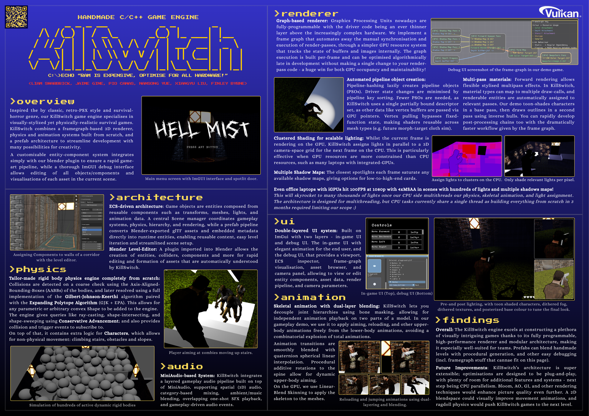

## KillSwitch. A Vulkan-1.4 High Performance Game Engine Built in 3 Months from Scratch.
##### A handmade framegraph-based 3D renderer, physics engine, dual-layer skeletal animation system, prefab-based entity system, procedural generation, key-rebinding, and more.

<a href="demo-dumb-zombo.gif" target="_blank" alt="Gameplay gif">
  
</a>
<a href="killswitch-poster.png" target="_blank" alt="Engine showcase poster">
  
</a>
<!--  -->
<!--  -->

- Jaime Gine: Physics engine and ECS
- Liam Swarbrick: Renderer, Build-system & Engine Architecture.
- Finley Byrne: Procedural Generation, Skeletal Animation, Blender Level Editor
- Nansong Yue: Key rebinds, GUI, intelligent thirdperson camera.
- Pio Cañas: Asset System, Skeletal Animation, rigged our assets for the demo game.
- Xiangyu Liu: Audio System

Of course a huge amount was done collectively. Code for demo game, core systems, etc. \:)


### Libraries

Libraries we did end up rellying on to reach the 3 month deadline (all very replacable, although SDL3 gives support for so many controllers and platforms it should probably stay):
- _SDL3_ - (cross platform way to open a window and get input)
- _miniaudio_ - (abstraction over the per-platform audio APIs)
- _cgltf_ (btw, glTF 2.0 is a ~~shit~~ meh native format for an engine. It was a mistake that we decided to use it with our ECS over a custom format)
- _imgui_ - (getting a ui on the screen fast was very useful for debugging especially)
- _imgui-node-editor_ - (to show the framegraph visually for debugging)
- _rapidjson_ - (JSON parser since our entities are JSON within glTF, not that we would do that if we were to do it again)
- _stb_image.h_ (for PNG loading), stb_ds.h (for hash table used in renderer's pipeline hashing because the C++ STL ~~is dog water~~ me no approve)
- AMD's Vulkan Memory Allocator (_vk_mem_alloc.h_).
- _volk_: Vulkan Proc Loader Library


### Build
```
The premake will build SDL from source, but you will likely need to install SDL's dependencies:
- https://wiki.libsdl.org/SDL3/README-linux#build-dependencies

On linux: do
$ ./premake5 gmake
$ make -j
$ ./bin/debug-game.exe
$
$ make -j config=release
$ ./bin/release-game.exe
```

Here's a simple way to generate intellisense if using clangd on vscode:
```
# Install bear, which listens to compile commands and generates the clangd 'compile_commands.json'
# Then build with
$ bear -- make -j
```

```
# On a fresh linux machine with bear installed, you can just do:
./premake5 gmake && bear -- make -j

# Or if you don't have bear and have some other way of getting intellisense:
./premake5 gmake && make -j
```

```
# I like doing this to build after added / changing file names and locations:
make clean && ./premake5 gmake && bear -- make -j
```


### Architecture Design So Far (this is section hasn't been updated since the initial repo was made)
Settling on a modular approach like this:

NOTE: modules e.g. /core/ have their api visible in /core/, while internal implementation (internal headers and source) for these modules that aren't part of an exported API should go in e.g. /core/impl/.
```
ARCHITECTURE NOTES:
Internal headers MUST NOT include the public API headers, but the .cpp implementation source code can include the public headers.

src/core/
|- core.h             <-- PUBLIC: No SDL includes here. Pure C/C++ types.
|- impl/
|  |- core_internal.h <-- PRIVATE: SDL includes, platform-specifics.
|  |- core.cpp        <-- IMPLEMENTATION.

src/renderer/
|- renderer.h              <-- PUBLIC: No Vulkan includes.
|- impl/
|  |- renderer_internal.h <-- PRIVATE: volk.h, vk_mem_alloc.h, etc.
|  |- renderer.cpp        <-- IMPLEMENTATION: Uses vulkan to render,..
NOTE: No Vulkan types in exposed API, only opaque handles and transform data.

src/game/
|- include/
|  |- ...
|- main.cpp  <-- Console app that the other modules as static libs to glue together the assetsystem, simulation, and renderer into a game. 

Also TODO similarly for: Asset system (assetsys/) and simulation system (simulation/).
```

```
MEMORY LEAK DETECTION:
Make sure each subsystem uses a ThreadAllocTracker (defined in core/my_c_runtime.h).
And use L_calloc and L_free instead of malloc and free
Example: See ThreadAllocTracker in renderer/impl/internal_state.h.
For runtime stuff try to use larger allocations and bulk data structures.
Contained one off allocations during init, shutdown and data uploads are fine,
but if allocs and frees are happening each frame at runtime, especially on the main
thread (not background asset loader threads), then that can be bad.

On shutdown of a module or subsystem of a module,
check for memory leaks with check_tracker_for_memory_leaks() e.g.:
    check_tracker_for_memory_leaks(&renderstate.main.tt);

This will output the exact file and line of code where an allocation occured that did was not freed.
And will output a green success message if all allocations were freed.
(In release mode all the overhead (which isn't much) of the alloc tracking is gone).
```
